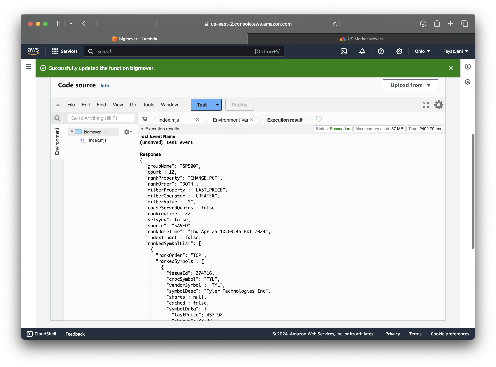
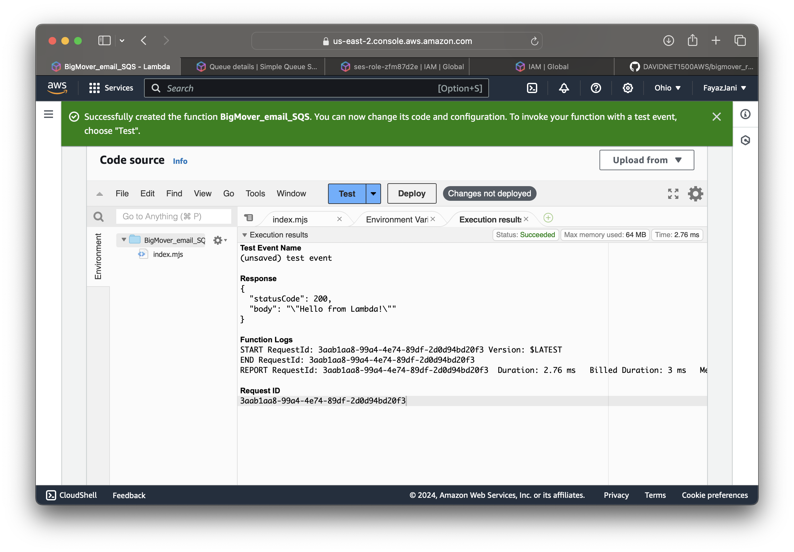
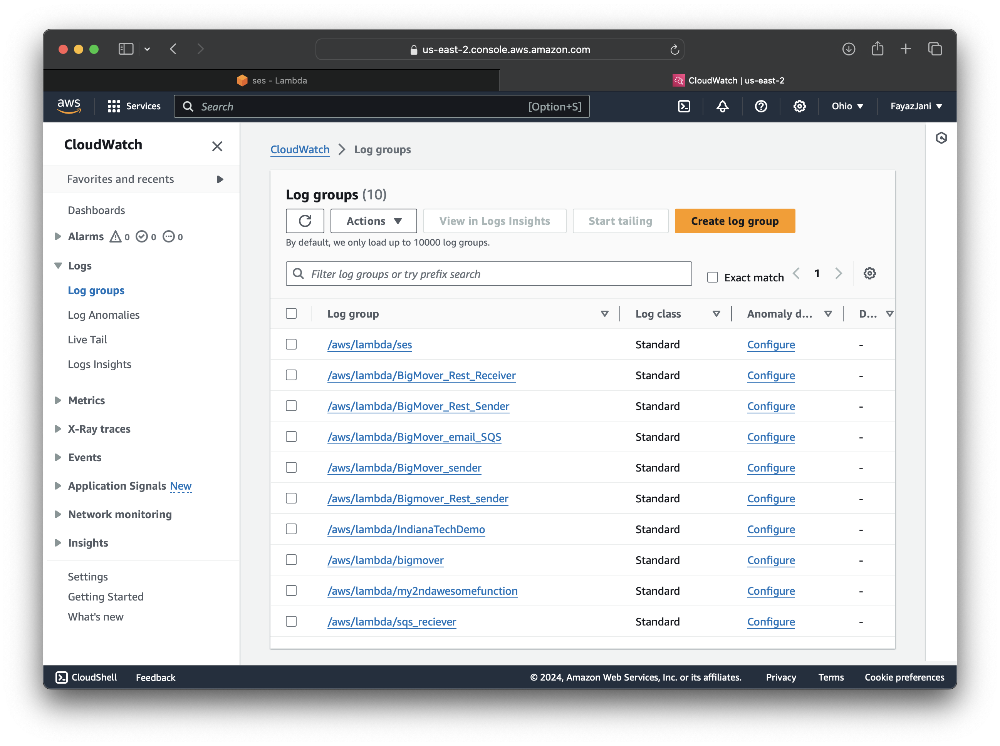

## Introduction

Dear Potential Employer,

I am thrilled to introduce myself as a highly motivated and skilled professional in the field of cloud computing and web development. With a deep passion for cutting-edge technologies and a commitment to delivering exceptional results, I am confident in my ability to contribute significantly to your organization.

### What is Lambda?

**AWS Lambda** is a serverless computing service provided by Amazon Web Services (AWS). It allows you to run code without provisioning or managing servers. With Lambda, you can execute your code in response to events or triggers, such as HTTP requests, database updates, or file uploads. This event-driven architecture enables you to build highly scalable and cost-effective applications without worrying about infrastructure management.

### What is SQS?

**Amazon Simple Queue Service (SQS)** is a fully managed message queuing service provided by AWS. It enables decoupling and scaling of microservices, distributed systems, and serverless applications. SQS allows you to send, store, and receive messages between software components, ensuring reliable and secure communication. This service is particularly useful for building asynchronous workflows, buffering and batching operations, and implementing resilient architectures.

### What is SES?

**Amazon Simple Email Service (SES)** is a cloud-based email sending service provided by AWS. It allows you to send transactional emails, marketing emails, and other types of communication from your applications. SES provides robust delivery capabilities, reputation monitoring, and compliance with email regulations. By using SES, you can offload the complexities of email delivery and focus on building your core application functionality.

### What is RESTful API?

A **RESTful API** (Representational State Transfer Application Programming Interface) is an architectural style for building web services that follow the principles of REST (Representational State Transfer). RESTful APIs use HTTP methods (GET, POST, PUT, DELETE) to perform operations on resources, which are identified by unique URLs. These APIs are designed to be stateless, scalable, and easily consumable by various clients, including web browsers, mobile applications, and other services.

RESTful APIs typically return data in lightweight formats like JSON or XML, making them language-agnostic and suitable for integration with diverse systems. They promote a clear separation of concerns between the client and server, enabling loose coupling and independent evolution of the components involved.

I hope this introduction provides you with a comprehensive understanding of my knowledge and expertise in these key areas. I am excited about the opportunity to further discuss my qualifications and contribute to your organization's success.

The **"Big Mover Serverless Web Application"** is designed to collect stock tickers opening significantly higher than the previous day, save them in Amazon DynamoDB, and send email notifications to users. It utilizes AWS Lambda for serverless computing, SES for email services, SQS for message queuing, and RESTful API architecture for communication. Lambda functions are triggered by configured events, SES is set up for email sending, SQS for queuing, and RESTful API ensures secure data exchange between systems. These services offer benefits like scalability, security, and reliability for efficient operation.

Thank you for your consideration.

Sincerely,
Fayaz Jani Sheik.